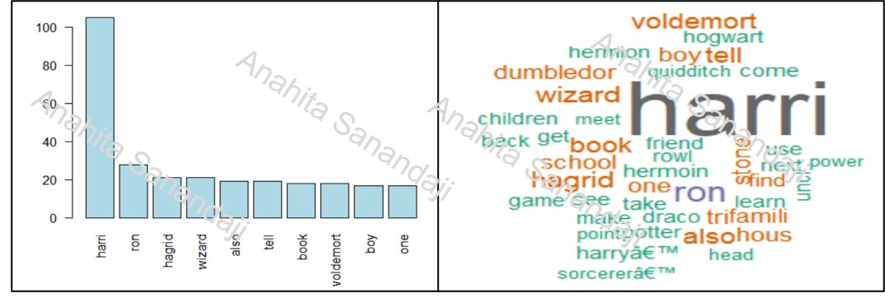

# Text and Sentiment Analysis Using R
In this project we use R to conduct text and sentiment analysis. The project has two main parts. Part 1 is about text analysis (calculating word frequencies, word associations,  and in Part 2 I focus on sentiment analysis.
## Part 1 Text Analysis with R
I conduct the text analysis in 5 main steps:
- **Step 0:** Read data from website or file.
- **Step 1:** Do some text pre-processing and data cleaning:
  * Remove HTML codes
  * Remove all punctuation marks
  * Remove all extra white space characters
  * Convert all data to lowercase, so that words like “read” and “Read” are considered the same word for analysis
- **Step 2:** Use a *VectorSource* function to prepare your data to be converted into a corpus. Then use the VCorpus function to take that data and turn it into a required corpus data structure to create a *TermDocumentMatrix*.
- **Step 3:** Use tm_map function to clean and prepare the text:
  * Remove stop words
  * Stem the data
- **Step 4:** Create "term document matrix", use TermDocumentMatrix, as a function that will take the Corpus  and create your matrix.
- **Step 5:** Do Analysis
  * Find Terms that occurs at least “???” times
  * Find words associated with "???" based on a given correlation of 90%
  * Calculate the frequency of words and create word cloud based on those frequencies. 

## Part 2: Sentiment Analysis Using R

