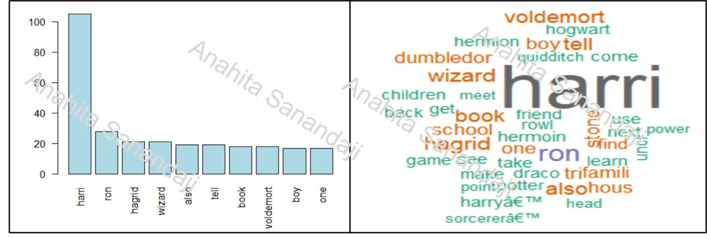

# Text Analysis with R
I conduct the text analysis in 5 main steps:
- **Step 0:** Read data from website or file.
~~~~
install.packages("tm")
install.packages("SnowballC")
install.packages("wordcloud")

library(tm)
library(SnowballC)
library(wordcloud)

# read data from a website
dataFromWeb <- readLines("http://cob.ohio.edu/anahitas/MIS4580/dataAnalysis.txt", warn= FALSE)

# read data from a file
dataFromFile <- readLines("HarryPotter.txt", warn= FALSE)
~~~~
- **Step 1:** Do some text pre-processing and data cleaning:
  * Remove HTML codes
  * Remove all punctuation marks
  * Remove all extra white space characters
  * Convert all data to lowercase, so that words like “read” and “Read” are considered the same word for analysis
~~~~
myCleanedData <- myData

#Remove HTML codes
myCleanedData <- gsub("<.*?>", "", myCleanedData)

#Remove all punctuation marks
myCleanedData <- gsub("[[:punct:]]","", myCleanedData)

#Remove some chars
myCleanedData <- gsub("â???","", myCleanedData)
myCleanedData <- gsub("T","", myCleanedData)

#Remove all extra white space characters
myCleanedData <- gsub("\\s+", " ", myCleanedData)
# NOTE: or use myCleanedData <- gsub("[[:space:]]"," ", myCleanedData)

#Convert all data to lowercase
myCleanedData <- tolower(myCleanedData)
~~~~

- **Step 2:** Use a *VectorSource* function to prepare your data to be converted into a corpus. Then use the VCorpus function to take that data and turn it into a required corpus data structure to create a *TermDocumentMatrix*.
~~~~
myCorpusData <- VCorpus(VectorSource((myCleanedData)))
myCorpusData[[1]]$content
~~~~

- **Step 3:** Use tm_map function to clean and prepare the text:
  * Remove stop words
  * Stem the data
~~~~
myMainCleanData <- myCorpusData
myMainCleanData <- tm_map(myMainCleanData,removeWords, stopwords("english"))
myMainCleanData <- tm_map(myMainCleanData,stemDocument)
~~~~

- **Step 4:** Create "term document matrix", use TermDocumentMatrix, as a function that will take the Corpus  and create your matrix.
~~~~
myTDMData <- TermDocumentMatrix(myMainCleanData)
~~~~

- **Step 5:** Do Analysis
  * Find Terms that occurs at least “???” times
  * Find words associated with "???" based on a given correlation of ??%
  * Calculate the frequency of words and create word cloud based on those frequencies. 

